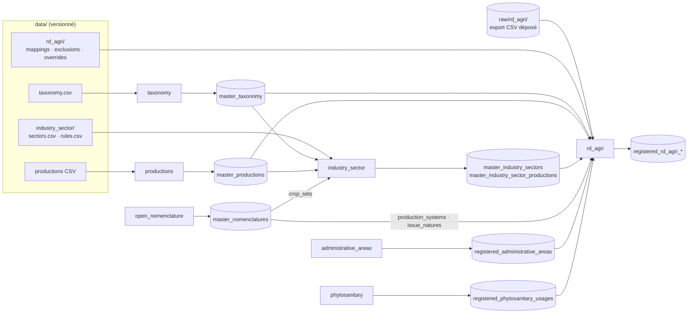

# Design — Taxonomie, `industry_sector`, `rd_agri`

> Conception issue de `/sc:design`, à partir de `claudedocs/brainstorm_rd_agri.md`
> (révision 5). Pas de code d'implémentation : DDL, formats de fichiers,
> algorithmes et contrats. Tous les chiffres viennent d'un **prototype**
> exécuté le 2026-09-15 sur la base `lexicon` 6.0.2 locale et l'export rd_agri
> complet (40 523 documents).

## 0. Vue d'ensemble

### 0.1 Trois chantiers

| # | Chantier | Nature | Fichiers touchés |
|---|---|---|---|
| 1 | Complétion taxonomie + productions | données | `data/taxonomy/taxonomy - taxonomy.csv`, `data/productions/productions - {crop,animal}_productions.csv` |
| 2 | Datasource `industry_sector` | nouvelle datasource | `lib/datasources/industry_sector.rb`, `data/industry_sector/*.csv` |
| 3 | Datasource `rd_agri` | nouvelle datasource | `lib/datasources/rd_agri.rb`, `data/rd_agri/*.csv`, `doc/datasources/rd_agri.md` |

### 0.2 Flux de données



### 0.3 Ordre d'exécution : contrainte non gérée par le framework

`Lexicon` n'ordonne pas les datasources :
- `NameRunner` suit l'ordre des arguments, ou l'ordre d'enregistrement quand il
  n'y en a pas ;
- `ParallelExecutor` (`run -P`) exécute en parallèle ;
- le DSL `Registerable.dependencies` n'est pas branché et contient une coquille
  (`@dependencie`).

Or `industry_sector` et `rd_agri` lisent des tables `lexicon` produites par
d'autres datasources.

**Décision** : chaque nouvelle datasource **vérifie ses prérequis** en tête de
`normalize` et échoue avec un message explicite (§2.5, §3.6). L'ordre est
documenté :

```sh
./lexicon run taxonomy productions open_nomenclature administrative_areas phytosanitary
./lexicon run industry_sector rd_agri
```

Brancher `dependencies` dans les executors serait souhaitable mais sort du
périmètre (§6, R2).

### 0.4 Normalisation textuelle (commune aux chantiers 2 et 3)

Une seule fonction de normalisation, appliquée **à l'identique** aux
vocabulaires et aux textes des documents :

```
norm(s) = trim( regexp_replace( lower( replace(s, '’', '''') ), '[^[:alnum:]]+', ' ', 'g' ) )
```

- casse ignorée, **accents conservés** (« maïs » ≠ « mais ») ;
- apostrophes et ponctuation → espace (« d’hiver » → « d hiver ») ;
- vérifié sur la base : `datctype = en_US.utf8`, `[[:alnum:]]` couvre les
  lettres accentuées, `'Éleveurs maïs' ~ '\mmaïs\M'` → vrai.

---

## 1. Chantier 1 — Complétion taxonomie + productions

### 1.1 Constat corrigé

- La racine **`fungus` existe déjà**, sous `bioproduct`, avec 5 familles de
  pathogènes. La révision 5 du brainstorm (TX2) disait le contraire : il n'y a
  **pas de racine à créer**, seulement des familles, genres et espèces.
- Les autres rangs parents existent déjà : `mammalia`, `aves`,
  `actinopterygii`, `insecta`, `bovidae`, `cervidae`, `phasianidae`,
  `salmonidae`, `salicaceae`, `bacteria`.
- `master_productions.specie` **n'a pas de clé étrangère** vers
  `master_taxonomy` : les productions non agricoles y portent des
  pseudo-espèces (`service`, `biogas`…). **On n'en ajoute pas**, pour ne pas
  casser ces 86 lignes.

### 1.2 Taxons à ajouter (`taxonomy - taxonomy.csv`)

Format existant : `reference_name,fra,eng,parent,taxonomic_rank`.

| reference_name | fra | eng | parent | rang | Pour |
|---|---|---|---|---|---|
| bubalus | Buffle | Buffalo | bovidae | genus | |
| bubalus_bubalis | Buffle d'Asie | Water buffalo | bubalus | specie | buffalo |
| cervus | Cerf | Deer | cervidae | genus | |
| cervus_elaphus | Cerf élaphe | Red deer | cervus | specie | deer |
| dama | Daim | Fallow deer | cervidae | genus | |
| dama_dama | Daim européen | European fallow deer | dama | specie | fallow_deer |
| camelidae | Camélidé | Camelidae | mammalia | family | |
| vicugna | Vigogne | Vicugna | camelidae | genus | |
| vicugna_pacos | Alpaga | Alpaca | vicugna | specie | alpaca |
| lama | Lama | Lama | camelidae | genus | |
| lama_glama | Lama domestique | Llama | lama | specie | llama |
| columbidae | Columbidé | Columbidae | aves | family | |
| columba | Pigeon | Pigeon | columbidae | genus | |
| columba_livia | Pigeon biset | Rock dove | columba | specie | pigeon |
| coturnix | Caille | Quail | phasianidae | genus | |
| coturnix_japonica | Caille japonaise | Japanese quail | coturnix | specie | quail |
| cyprinidae | Cyprinidé | Cyprinidae | actinopterygii | family | |
| cyprinus | Carpe | Carp | cyprinidae | genus | |
| cyprinus_carpio | Carpe commune | Common carp | cyprinus | specie | carp |
| oncorhynchus | Oncorhynque | Oncorhynchus | salmonidae | genus | |
| oncorhynchus_mykiss | Truite arc-en-ciel | Rainbow trout | oncorhynchus | specie | trout |
| oligochaeta | Oligochète | Oligochaeta | animal | class | (AGROVOC c_29111) |
| lumbricidae | Lombricidé | Lumbricidae | oligochaeta | family | |
| eisenia | Eisenia | Eisenia | lumbricidae | genus | earthworm (Q18) |
| tenebrionidae | Ténébrionidé | Tenebrionidae | insecta | family | |
| tenebrio | Ténébrion | Tenebrio | tenebrionidae | genus | insect (Q18, **D5** → AGROVOC c_7665) |
| pinaceae | Pinacée | Pinaceae | plant | family | |
| abies | Sapin | Fir | pinaceae | genus | christmas_tree (Q18) |
| populus | Peuplier | Poplar | salicaceae | genus | poplar |
| agaricaceae | Agaricacée | Agaricaceae | fungus | family | |
| agaricus | Agaric | Agaricus | agaricaceae | genus | |
| agaricus_bisporus | Champignon de Paris | Button mushroom | agaricus | specie | mushroom |
| pleurotaceae | Pleurotacée | Pleurotaceae | fungus | family | |
| pleurotus | Pleurote | Pleurotus | pleurotaceae | genus | |
| pleurotus_ostreatus | Pleurote en huître | Oyster mushroom | pleurotus | specie | oyster_mushroom |
| omphalotaceae | Omphalotacée | Omphalotaceae | fungus | family | |
| lentinula | Lentinula | Lentinula | omphalotaceae | genus | |
| lentinula_edodes | Shiitake | Shiitake | lentinula | specie | shiitake |
| tuberaceae | Tubéracée | Tuberaceae | fungus | family | |
| tuber | Truffe | Truffle | tuberaceae | genus | truffle (plusieurs espèces cultivées → genre) |
| cyanobacteria | Cyanobactérie | Cyanobacteria | bacteria | phylum | |
| arthrospira | Arthrospira | Arthrospira | cyanobacteria | genus | |
| arthrospira_platensis | Spiruline | Spirulina | arthrospira | specie | spirulina |
| algae | Algue | Algae | bioproduct | | racine, au même niveau que `plant` et `fungus` (AGROVOC c_258) |
| phaeophyceae | Algue brune | Brown algae | algae | class | (AGROVOC c_5754) |
| laminaria | Laminaire | Laminaria | phaeophyceae | genus | seaweed (Q18, **D1** → AGROVOC c_4164) |

**46 lignes.** Les rangs intermédiaires manquants (ordre, embranchement) sont
omis, comme dans le reste du fichier (familles directement sous `plant`, par
exemple). Pour les algues, on suit AGROVOC : *Laminaria* directement sous
*Phaeophyceae*, sans famille.

#### 1.2.1 D1 et D5 tranchés avec AGROVOC

Requêtes SPARQL sur https://agrovoc.fao.org/sparql, le 2026-09-15 :

| Production | Genre retenu | Justification AGROVOC | Écarté |
|---|---|---|---|
| seaweed | **`laminaria`** (c_4164) | `kelp` (c_11954), seul concept plus spécifique que `algue marine` (c_14154) rattaché à un taxon, `isProducedBy` *Laminaria*. Lignée : Laminaria → Phaeophyceae → Algae. | *Saccharina* : **absent** d'AGROVOC ; *Undaria* : présent mais sans lien avec « algue marine » |
| insect | **`tenebrio`** (c_7665) | `insects as food` (c_1387359917754) `isUseOf` *yellow mealworm* ; `insect protein` (c_1387363306809) `isDerivedFrom` *yellow mealworm* ; *yellow mealworm* = *Tenebrio molitor* (c_30174). Lignée : Tenebrio → Tenebrionidae → Coleoptera → Insecta. | *Hermetia* (c_0cbb23a5) et *Acheta* (c_86) : présents, **sans lien d'usage** alimentaire ou d'élevage |

Vérifications complémentaires dans AGROVOC :
- **christmas_tree → `abies`, confirmé.** `Christmas trees` (c_1591) `isUseOf`
  *Abies*, *Picea* et *Pinus* ; *Abies* (lignée Pinaceae) et *Abies
  nordmanniana* sont présents.
- **earthworm → `eisenia` (Q18) : AGROVOC ne descend pas jusqu'au genre.**
  `earthworms` (c_29109) et `vermiculture` (c_24262) ne renvoient qu'à la
  classe *Oligochaeta* (c_29111), et *Eisenia* est absent. On garde `eisenia`
  (genre de *E. fetida*, espèce de référence en lombriculture) et on aligne la
  lignée sur AGROVOC : Oligochaeta → Lumbricidae → Eisenia.

### 1.3 Productions à mettre à jour (colonne `specie`)

| Fichier | reference_name | specie |
|---|---|---|
| animal_productions | buffalo | bubalus_bubalis |
| animal_productions | deer | cervus_elaphus |
| animal_productions | fallow_deer | dama_dama |
| animal_productions | alpaca | vicugna_pacos |
| animal_productions | llama | lama_glama |
| animal_productions | pigeon | columba_livia |
| animal_productions | quail | coturnix_japonica |
| animal_productions | carp | cyprinus_carpio |
| animal_productions | trout | oncorhynchus_mykiss |
| animal_productions | earthworm | eisenia |
| animal_productions | insect | tenebrio |
| crop_productions | christmas_tree | abies |
| crop_productions | poplar | populus |
| crop_productions | mushroom | agaricus_bisporus |
| crop_productions | oyster_mushroom | pleurotus_ostreatus |
| crop_productions | shiitake | lentinula_edodes |
| crop_productions | truffle | tuber |
| crop_productions | spirulina | arthrospira_platensis |
| crop_productions | seaweed | laminaria |

**19 productions.** Les 13 restantes (agroforestry, aquaponics, hydroponics,
vertical_farming, cut_flower, edible_flower, energy_wood, forestry,
fruit_nursery, seed_cereal, seed_forage, seed_vegetable, vegetable_seedling)
sont des systèmes ou des usages et **restent sans espèce** (TX4).

### 1.4 Validation

```sql
-- V1 : aucun parent orphelin (vrai aujourd'hui, doit le rester)
SELECT reference_name FROM master_taxonomy c
 WHERE parent IS NOT NULL
   AND NOT EXISTS (SELECT 1 FROM master_taxonomy p WHERE p.reference_name = c.parent);

-- V2 : toute espèce de production agricole existe dans la taxonomie (attendu : 0 ligne)
SELECT reference_name, specie FROM master_productions
 WHERE activity_family IN ('plant_farming','animal_farming','vine_farming')
   AND specie IS NOT NULL
   AND specie NOT IN (SELECT reference_name FROM master_taxonomy);

-- V3 : non-régression des consommateurs à clé étrangère vers master_taxonomy
--   master_variants.{specie,target_specie}, master_production_yields.specie,
--   master_production_prices.specie, registered_seed_varieties.id_specie
--   → ./lexicon run taxonomy puis ./lexicon validate, décomptes identiques avant/après
```

Les ajouts n'affectent pas les clés étrangères existantes : on ne modifie ni ne
supprime aucun `reference_name`.

---

## 2. Chantier 2 — Datasource `industry_sector`

### 2.1 Identité

```ruby
module Datasources
  class IndustrySector < Base
    description 'Filières agricoles et appartenance des productions'
    credits name: 'Filières agricoles', url: 'https://ekylibre.com', provider: 'Ekylibre SAS',
            licence: 'CC-BY-SA 4.0', licence_url: 'https://creativecommons.org/licenses/by-sa/4.0/deed.fr',
            updated_at: '<date de livraison>'
    # collect / load / normalize / self.table_definitions
  end
end
```

### 2.2 Tables

```sql
CREATE TABLE master_industry_sectors (
  reference_name character varying PRIMARY KEY NOT NULL,
  parent         character varying,
  depth          integer NOT NULL,              -- 0 pour une racine
  translation_id character varying NOT NULL     -- 'industry_sectors_<reference_name>'
);
CREATE INDEX master_industry_sectors_parent ON master_industry_sectors (parent);

CREATE TABLE master_industry_sector_productions (
  industry_sector character varying NOT NULL,
  production      character varying NOT NULL,
  direct          boolean NOT NULL,              -- false = hérité d'une sous-filière
  PRIMARY KEY (industry_sector, production)
);
CREATE INDEX master_industry_sector_productions_production
  ON master_industry_sector_productions (production);
```

Clés étrangères (DSL `references`) :
- `master_industry_sectors.parent` → `master_industry_sectors.reference_name` ;
- `master_industry_sector_productions.industry_sector` → `master_industry_sectors.reference_name` ;
- `master_industry_sector_productions.production` → `master_productions.reference_name`.

**Fermeture matérialisée** : une filière contient ses productions **et** celles
de ses descendants. Ainsi `field_crops` contient les céréales, oléagineux…
avec `direct = false`. Les consommateurs, rd_agri comme Ekylibre, n'ont pas à
parcourir la hiérarchie.

### 2.3 Fichiers `data/industry_sector/`

**`sectors.csv`** : `reference_name,parent,fra,eng`

**`rules.csv`** : `industry_sector,activity_family,usage,taxon,crop_set,production,exclude`

Sémantique d'une règle (ligne) :
- une production **correspond** si **tous** les critères non vides sont vrais
  (ET logique) :
  - `activity_family` : égalité ;
  - `usage` : égalité avec `master_productions.usage` ;
  - `taxon` : `specie` égale à ce taxon **ou en descend** (hiérarchie `parent`) ;
  - `crop_set` : `specie` descend d'un des taxons de
    `master_nomenclatures[nomenclature='crop_sets', name=crop_set].properties.varieties` ;
  - `production` : égalité avec `reference_name`.
- appartenance **directe** d'une filière = ⋃ des règles `exclude=false` −
  ⋃ des règles `exclude=true` ;
- appartenance **totale** = appartenance directe de la filière ∪ celles de
  tous ses descendants.

### 2.4 Contenu initial (validé par prototype)

Hiérarchie, 30 filières, avec l'effectif **total** mesuré :

```
livestock  Élevage (53)                     crops  Productions végétales (≈307)
├─ cattle        Bovins (7)                  ├─ field_crops       Grandes cultures (≈86)
│  ├─ beef_cattle    Bovins viande (4)       │  ├─ cereals            Céréales (38)
│  └─ dairy_cattle   Bovins lait (2)         │  ├─ oilseeds           Oléagineux (20)
├─ sheep         Ovins (4)                   │  ├─ protein_crops      Protéagineux (19)
│  ├─ meat_sheep     Ovins viande (2)        │  └─ industrial_crops   Cultures industrielles (9)
│  └─ dairy_sheep    Ovins lait (1)          ├─ forage_grassland  Fourrages et prairies (42)
├─ goats         Caprins (4)                 │  └─ grassland          Prairies (12)
├─ pigs          Porcins (4)                 ├─ vegetables        Légumes (72)
├─ poultry       Volailles (9)               ├─ fruits            Fruits (45)
├─ equines       Équins (5)                  ├─ viticulture       Viticulture (2)
├─ rabbits       Cuniculture (2)             ├─ ppam              PPAM (39)
├─ beekeeping    Apiculture (2)              ├─ horticulture      Horticulture et pépinières (23)
├─ aquaculture   Aquaculture (7)             ├─ seeds             Semences (5)
└─ other_livestock Autres élevages (9)       └─ forestry          Sylviculture et agroforesterie (6)
```

Résultats du prototype :
- **53/53** productions `animal_farming` ont une filière : FG6 respecté.
- 22 productions végétales restent **sans filière**, listées dans le log :
  jachères, intercultures, couverts, bordures, `crop_production`, `oak`,
  `coffee`, `turmeric`, `vetiver`, `eucalyptus`, psyllium, `purslane`,
  `truffle`, `seaweed`, `spirulina`.
- 33 productions appartiennent à plusieurs filières directes (soja,
  camomille, lavande…), comme voulu.

Les règles complètes (91 lignes) sont en **annexe A**. Principes :
- les élevages passent par `taxon` (+ `usage` pour viande/lait) ;
- les volailles par familles (`phasianidae`, `anatidae`, `numididae`) plus
  pigeon et caille ;
- les grandes cultures par `usage=grain` + `crop_set` (`cereals`, `oleaginous`)
  ou `taxon=fabaceae`, plus les génériques (`cereal`, `oleaginous`,
  `proteaginous`…) ;
- les légumes, fruits, semences et bois par `usage` ;
- les PPAM par `crop_set=aromatics_and_medicinals` ;
- exclusions explicites : couverts, `truffle`, `potato_starch` et
  `root_chicory` hors légumes.

À noter : **aucune production « betterave sucrière »** n'existe dans
`master_productions`, alors que rd_agri y consacre de nombreux documents (ITB).
Voir §6, R8.

### 2.5 Algorithme `normalize`

```
0. Prérequis (échec explicite si vide) :
   master_productions, master_taxonomy, master_nomenclatures[crop_sets]
1. DELETE FROM master_translations WHERE id LIKE 'industry_sectors_%'
2. INSERT master_industry_sectors
     depth calculée par CTE récursive sur parent
     → échec si cycle ou parent inconnu
   INSERT master_translations (id='industry_sectors_'||reference_name, fra, eng)
3. Contrôle des règles → échec si :
     production, taxon, crop_set ou industry_sector inconnus ;
     règle sans aucun critère
4. Table temporaire  <schema>.ancestors(production, taxon)
     CTE récursive depuis master_productions.specie en remontant parent (profondeur ≤ 30)
5. Table temporaire  <schema>.crop_set_taxa(crop_set, taxon)
     jsonb_array_elements_text(properties->'varieties')
6. Table temporaire  <schema>.matches(industry_sector, production, exclude)
     jointure rules × master_productions avec les 5 critères (EXISTS sur ancestors / crop_set_taxa)
7. direct = matches(exclude=false) EXCEPT matches(exclude=true)
8. INSERT master_industry_sector_productions
     CTE récursive descendants(root, node) ⨝ direct
     direct = bool_or(root = node)
9. Log :
     effectif par filière ;
     productions animal_farming sans filière → échec (FG6) ;
     productions plant/vine_farming sans filière → avertissement
```

`collect` copie `data/industry_sector/*.csv` dans `dir` ; `load` fait
`load_csv` sur les deux fichiers.

---

## 3. Chantier 3 — Datasource `rd_agri`

### 3.1 Identité

```ruby
module Datasources
  class RdAgri < Base
    description 'Documents de la plateforme R&D agricole et leurs liens aux référentiels Lexicon'
    credits name: 'Plateforme R&D Agricole', url: 'https://rd-agri.fr', provider: 'rd-agri (ACTA)',
            licence: 'CC BY-NC-SA 4.0', licence_url: 'https://creativecommons.org/licenses/by-nc-sa/4.0/deed.fr',
            updated_at: '<date de l’export>'   # à mettre à jour à chaque nouvel export (procédure §3.9)
  end
end
```

### 3.2 Fichiers

```
raw/rd_agri/                       (non versionné)
  <export déposé>.csv              nom quelconque, déposé à la main
  documents.csv                    produit par collect (sans BOM, sans Auteurs)
  *.csv                            copies de data/rd_agri/

data/rd_agri/                      (versionné)
  keyword_mappings.csv   keyword,target_kind,target        target_kind ∈ industry_sector|production|ignore
  publishers.csv         raw,canonical
  languages.csv          raw,iso                            iso ∈ fra|eng|nld|…
  giee_regions.csv       prefix,region_code                 AGINOR,28 …
  pest_exclusions.csv    term
  area_exclusions.csv    term,reason                        pour le canal title uniquement
  taxon_expansion_exclusions.csv  taxon,production          ex. brassica_napus,rutabaga
  overrides.csv          document_id,target_kind,target,action   action ∈ add|remove
```

### 3.3 `collect`

```
1. Candidats = raw/rd_agri/*.csv, sauf les fichiers produits par collect et les copies de data/
2. Pour chaque candidat, lire uniquement l'en-tête (CSV ';', BOM toléré) :
   retenu si l'en-tête ⊇ EXPECTED_HEADERS
     (Type, Titre, Année de publication, Description, Mots-clés, URL de la notice,
      Code projet, Nom du projet, Organisme(s), Publicateur, Date de création,
      Date de publication, Langue, Labels tirés de l'enrichissement,
      URL de la page, URL du document)
   et si la première ligne a Type = 'Document'
3. 0 candidat   → raise "Export rd_agri absent de raw/rd_agri/ — voir doc/datasources/rd_agri.md"
   n candidats  → prendre le plus récent (mtime) et journaliser les autres
4. Réécriture en flux (CSV Ruby, ligne à ligne) vers documents.csv :
   - séparateur ',', UTF-8 sans BOM, fins de ligne LF ;
   - colonnes renommées en ASCII (id, title, publication_year, description, keywords,
     notice_url, project_code, project_name, organisms, publisher, created_on,
     published_on, language, labels, page_url, document_url) ;
   - id = dernier segment de URL de la page (UUID) ;
   - colonne Auteurs NON écrite : la donnée nominative n'entre jamais en base ;
   - exported_on = date de modification du fichier source (colonne ajoutée)
5. Échec si 0 ligne écrite ou si des id sont dupliqués
6. Copie de data/rd_agri/*.csv dans dir
```

### 3.4 `load`

`load_csv` sur `documents.csv` et sur chaque fichier de `data/rd_agri/`. Toutes
les colonnes arrivent en `VARCHAR` dans le schéma `rd_agri`.

⚠️ **R1** : `Loader::Csv#detect_encoding` lit **tout** le fichier en mémoire
(≈ 320 Mo). Voir §6.

### 3.5 Tables produites

```sql
CREATE TABLE registered_rd_agri_documents (
  id               character varying PRIMARY KEY NOT NULL,   -- UUID rd-agri
  title            character varying NOT NULL,               -- repli : nom du projet
  description      text,                                     -- HTML retiré
  publication_year integer,                                  -- NULL si 0 ou 1900
  published_on     date,
  created_on       date,
  publisher        character varying,                        -- libellé canonique
  publisher_label  character varying,                        -- libellé d'origine
  language         character varying,                        -- ISO 639-2 (fra, eng…)
  keywords         text[] NOT NULL DEFAULT '{}',             -- mots-clés auteurs nettoyés
  project_code     character varying,
  project_name     character varying,
  page_url         character varying NOT NULL,
  notice_url       character varying,
  document_url     character varying,
  exported_on      date NOT NULL
);
CREATE INDEX registered_rd_agri_documents_project_code ON registered_rd_agri_documents (project_code);
CREATE INDEX registered_rd_agri_documents_publication_year ON registered_rd_agri_documents (publication_year);

CREATE TABLE registered_rd_agri_document_productions (
  document_id character varying NOT NULL,
  production  character varying NOT NULL,
  channels    text[] NOT NULL,             -- ⊆ {keyword,label,title,override}
  PRIMARY KEY (document_id, production)
);
CREATE INDEX registered_rd_agri_document_productions_production ON registered_rd_agri_document_productions (production);

CREATE TABLE registered_rd_agri_document_taxa (
  document_id character varying NOT NULL,
  taxon       character varying NOT NULL,
  channels    text[] NOT NULL,
  PRIMARY KEY (document_id, taxon)
);
CREATE INDEX registered_rd_agri_document_taxa_taxon ON registered_rd_agri_document_taxa (taxon);

CREATE TABLE registered_rd_agri_document_areas (
  document_id character varying NOT NULL,
  area_kind   character varying NOT NULL,  -- region | department
  area_code   character varying NOT NULL,
  channels    text[] NOT NULL,             -- ⊆ {project_code,organism,title,override}
  PRIMARY KEY (document_id, area_kind, area_code)
);
CREATE INDEX registered_rd_agri_document_areas_area ON registered_rd_agri_document_areas (area_kind, area_code);

CREATE TABLE registered_rd_agri_document_production_systems (
  document_id       character varying NOT NULL,
  production_system character varying NOT NULL,  -- master_nomenclatures.name (nomenclature='production_systems')
  channels          text[] NOT NULL,
  PRIMARY KEY (document_id, production_system)
);

CREATE TABLE registered_rd_agri_document_pests (
  document_id    character varying NOT NULL,
  pest_source    character varying NOT NULL CHECK (pest_source IN ('ephy_target','issue_nature')),
  pest_reference character varying NOT NULL,   -- ephy : target_name_label_fra ; issue_nature : master_nomenclatures.name
  label          character varying NOT NULL,   -- libellé fra, pour l'affichage
  channels       text[] NOT NULL,
  PRIMARY KEY (document_id, pest_source, pest_reference)
);
CREATE INDEX registered_rd_agri_document_pests_ref ON registered_rd_agri_document_pests (pest_source, pest_reference);
```

Clés étrangères déclarées avec `references` :
- `document_id` → `registered_rd_agri_documents.id`, sur les 5 tables de liens ;
- `production` → `master_productions.reference_name` ;
- `taxon` → `master_taxonomy.reference_name`.

**Pas de clé étrangère possible**, car la cible a une clé composite ou n'a pas
de clé (le DSL ne gère qu'une colonne) :
- zones → `registered_administrative_areas (kind, code)` ;
- systèmes → `master_nomenclatures (nomenclature, name)` ;
- ravageurs → `registered_phytosanitary_usages.target_name_label_fra` (non
  unique) et `master_nomenclatures`.

→ Intégrité contrôlée par **anti-jointure** en fin de `normalize` (§3.6, étape 9).

**Ajout de `registered_rd_agri_document_taxa`**, absente du brainstorm : elle
conserve le lien précis document → taxon (« Colza » → `brassica_napus`), avant
l'élargissement aux productions, qui peut être moins précis (§3.7.4).

### 3.6 Algorithme `normalize` (SQL, schéma de travail `rd_agri`)

```
0. PRÉREQUIS → raise si l'une des tables est vide :
   master_productions, master_taxonomy, master_industry_sector_productions,
   master_nomenclatures (production_systems, issue_natures),
   registered_administrative_areas, registered_phytosanitary_usages
   → raise aussi si un fichier de correspondance référence une cible inconnue
     (filière, production, taxon, code région)

1. DOCUMENTS → registered_rd_agri_documents
   - title            COALESCE(NULLIF(trim(title),''), project_name)
   - description      regexp_replace(<html>, '<[^>]+>', ' ', 'g') puis compression des espaces
   - publication_year NULLIF(NULLIF(year,'0'),'1900')::int
   - *_on             date FR « 05 janvier 2026 » : mois en toutes lettres → numéro,
                      via une table de 12 lignes dans le schéma de travail, puis to_date
   - publisher        COALESCE(publishers.canonical, trim(publisher))
   - language         languages.iso (jointure sur norm(raw))
   - keywords         tableau des mots-clés découpés sur , et ; (trim, dédoublonnés)

2. VOCABULAIRES (tables de travail, colonne term = norm(libellé)) :
   voc_keyword(term, target_kind, target)     ← keyword_mappings
   voc_production(term, production)           ← master_translations.fra des productions
                                                agricoles (plant/animal/vine_farming)
   voc_taxon(term, taxon)                     ← traductions fra de master_taxonomy,
                                                rangs genus/specie/subspecie/variety, len(term) ≥ 4
   voc_system(term, name)                     ← master_nomenclatures[production_systems].label->>'fra'
   voc_pest(term, source, reference, label)   ← target_name_label_fra distincts
                                                (sans les libellés contenant '*' ni les abréviations '.')
                                                ∪ master_nomenclatures[issue_natures]
                                                − pest_exclusions
   voc_area(term, kind, code)                 ← registered_administrative_areas.name
   voc_all = UNION des termes (sert à préfiltrer les labels)

3. JETONS DES DOCUMENTS
   doc_text(id, title_n, text_n)   norm(title), norm(title || ' ' || description)
   doc_kw(id, term)                unnest(keywords) normalisés
   doc_label(id, term)             regexp_split_to_table(labels, ',') normalisés,
                                   GARDÉS SEULEMENT SI term ∈ voc_all
                                   (on ne matérialise pas les ≈ 15 M de labels bruts)
   doc_label_ok(id, term)          doc_label dont le terme est confirmé dans le texte :
                                   text_n ~ ('\m' || regex_escape(term) || 's?\M')

4. N-GRAMMES DU TITRE (canal title)
   doc_ngram(id, pos, len, gram)   n-grammes de 1 à 6 mots de title_n
                                   (≈ 40 k titres × ~10 mots × 6 ≈ 2,4 M lignes)
   title_hit(id, pos, len, term, voc)   jointure par égalité avec gram = term
                                        OU gram = term || 's'
   title_hit_longest               on retire un hit si un autre hit plus long
                                   du même document couvre ses positions
                                   (règle du libellé le plus long)

5. PRODUCTIONS → registered_rd_agri_document_productions
   canal keyword :
     doc_kw ⨝ voc_keyword :
       industry_sector → master_industry_sector_productions (toutes, Q10)
       production      → production
       ignore          → rien
     sinon doc_kw ⨝ voc_production
     sinon doc_kw ⨝ voc_taxon → élargissement (§3.7.4)
   canal label :
     doc_label_ok ⨝ voc_production ;  doc_label_ok ⨝ voc_taxon → élargissement
   canal title :
     title_hit_longest ⨝ voc_keyword (mêmes règles que le canal keyword ; résout « ovins lait »)
                       ∪ ⨝ voc_production  ∪ ⨝ voc_taxon → élargissement
   agrégation : GROUP BY (document_id, production), channels = array_agg(DISTINCT canal)

6. TAXONS → registered_rd_agri_document_taxa
   les correspondances voc_taxon des 3 canaux, avant élargissement

7. ZONES → registered_rd_agri_document_areas
   canal project_code : substring(project_code FROM '^\d{2}([A-Z]+)_') ⨝ giee_regions
   canal organism     : n-grammes de chaque organisme ⨝ voc_area (plus long d'abord)
   canal title        : title_hit_longest ⨝ voc_area, termes de area_exclusions retirés

8. SYSTÈMES ET RAVAGEURS
   systems : doc_kw ∪ doc_label_ok ∪ title_hit_longest ⨝ voc_system
   pests   : doc_kw ∪ doc_label_ok ∪ title_hit_longest ⨝ voc_pest

9. OVERRIDES puis INTÉGRITÉ
   overrides : remove → DELETE ; add → INSERT … ON CONFLICT
               (le canal 'override' est ajouté au tableau channels)
   anti-jointures → raise si > 0 :
     zones ∉ registered_administrative_areas
     systèmes ∉ master_nomenclatures[production_systems]
     ravageurs ∉ vocabulaire source

10. STATISTIQUES (journal) :
    documents, % liés par table et par canal, liens moyens par document lié,
    top 20 des termes par canal (pour la revue de précision)
```

`regex_escape(term)` =
`regexp_replace(term, '([.^$*+?()\[\]{}|\\-])', '\\\1', 'g')`. Les termes sont
déjà normalisés (§0.4), ce qui laisse peu de métacaractères.

### 3.7 Règles de résolution

#### 3.7.1 Canaux

| Canal | Source | Filtre |
|---|---|---|
| `keyword` | Mots-clés auteurs | égalité normalisée |
| `label` | Labels d'enrichissement | présent dans le titre ou la description (pluriel toléré) |
| `title` | Titre | n-grammes, libellé le plus long prioritaire |
| `project_code` | Préfixe GIEE du code projet | table `giee_regions` |
| `organism` | Organisme(s) | n-grammes ⨝ noms de zones |
| `override` | `overrides.csv` | manuel |

#### 3.7.2 Priorité des vocabulaires, pour un même terme

`voc_keyword` > `voc_production` > `voc_taxon`. Si un terme est à la fois une
filière déclarée dans `keyword_mappings` et un libellé de taxon (« Vigne »),
seule la filière est retenue, pour ne pas doubler les liens.

#### 3.7.3 Mots-clés ignorés

« Productions animales » et « Productions végétales » ont
`target_kind=ignore` (Q16).

#### 3.7.4 Élargissement taxon → productions

Un taxon atteint les productions **agricoles** dont `specie` est ce taxon ou
en descend, **avec deux restrictions** (issues du prototype) :
1. la production appartient à **au moins une filière** : cela écarte les
   couverts `summery_cover` et `relay_cover`, dont `specie = zea_mays`, que
   « Maïs » ramenait ;
2. le couple (taxon, production) n'est pas dans
   `taxon_expansion_exclusions.csv`. Liste initiale :
   `brassica_napus,rutabaga` (« Colza » ramenait le rutabaga),
   `beta_vulgaris,chard` ; à compléter lors de la revue de précision.

### 3.8 Contenu initial des fichiers de correspondance

**`keyword_mappings.csv`**, 37 lignes, extrait :

| keyword | target_kind | target |
|---|---|---|
| Bovin viande | industry_sector | beef_cattle |
| Bovin lait · Production laitière | industry_sector | dairy_cattle |
| Bovins | industry_sector | cattle |
| Jeunes bovins | production | young_bull |
| Veau de boucherie | production | calf |
| Caprin · Caprins | industry_sector | goats |
| Ovin viande / Ovin lait / Ovin · Ovins | industry_sector | meat_sheep / dairy_sheep / sheep |
| Porcin | industry_sector | pigs |
| Volaille · Volailles de chair | industry_sector | poultry |
| Equin | industry_sector | equines |
| Grande culture | industry_sector | field_crops |
| Céréale | industry_sector | cereals |
| Légume · Végétal-Maraichage | industry_sector | vegetables |
| Fruit | industry_sector | fruits |
| Vigne | industry_sector | viticulture |
| Prairie · Prairie permanente · Prairie temporaire · Herbe | industry_sector | grassland |
| Fourrages · Cultures fourragères · Plante fourragère · Systèmes fourragers | industry_sector | forage_grassland |
| horticulture · horticulteurs · horticole | industry_sector | horticulture |
| Légumineuses | industry_sector | protein_crops |
| Agroforesterie | production | agroforestry |
| Productions animales · Productions végétales | ignore | |

**`pest_exclusions.csv`** (D3), 20 termes : désherbage, désherb. total,
adventices, fongicide, insecticide, désinfection, inoculation, virus,
ravageurs divers, ravageurs du sol, maladies du feuillage, maladies de
conservation, champignons autres que pythiacées, champignons pythiacées,
bactérioses, maladie, sécheresse, oiseaux, vers de terre, mouches.
Les libellés E-phy contenant `*` (« Désherbage*Cult. Installées ») ou des
abréviations (« Stimul. Déf. Plantes ») sont écartés **par règle**, sans
figurer dans la liste.

**`area_exclusions.csv`** (D4, canal title uniquement), 19 termes : Rhône,
Loire, Nord, Cher, Orne, Var, Lot, Ain, Indre, Marne, Aude, Gard, Meuse, Oise,
Somme, Vienne, Charente, Dordogne, Garonne. Ce sont des départements homonymes
d'un fleuve, d'un nom commun ou d'un point cardinal. Les formes longues
(« Pays de la Loire », « Haute-Vienne ») restent reconnues grâce à la règle du
plus long.

**`giee_regions.csv`**, 17 lignes : AGINOR→28, AGIOCC→76, AGIARA→84, AGINA→75,
AGIPDL→52, AGIPACA→93, AGIBZH→53, AGIGE→44, AGIBFC→27, AGICVL→24, AGIHDF→32,
AGICOR→94, AGIMAR→02, AGIGUA→01, AGIMAY→06, AGIIF→11, AGIHF→32.

**`publishers.csv`** : à construire à partir des 541 valeurs. Regroupements
connus : `IDELE` / `idele – Institut de l'élevage` → IDELE ;
`Chambres d'agriculture` / `CDA France` / `CRA *` → Chambres d'agriculture ;
`IFV` / `IFV - Institut Français de la Vigne et du Vin` → IFV ; `ARVALIS` /
`Arvalis` → Arvalis.

**`languages.csv`** : Français, français, Francais, Fancais, FR → `fra` ;
anglais, Anglais, English → `eng` ; Néerlandais → `nld` ; Autres → NULL.

### 3.9 Procédure de mise à jour (`doc/datasources/rd_agri.md`)

1. Sur rd-agri.fr : recherche **sans filtre**, puis bouton d'export CSV.
2. Déposer le fichier dans `raw/rd_agri/`, sous n'importe quel nom.
3. Mettre à jour `updated_at` dans `credits`.
4. `./lexicon run rd_agri`, après les prérequis (§0.3).
5. Relire les statistiques du journal. Si un nouveau mot-clé fréquent apparaît,
   compléter `keyword_mappings.csv`.

### 3.10 Mesures du prototype (attendus d'implémentation)

| Liaison | Documents liés | Détail |
|---|---:|---|
| **Productions** | **18 052 (44,5 %)** | keyword 20,2 % · label 22,2 % · title 26,3 % ; 218 500 liens, 12,1 par document lié |
| Zones | 12 368 (30,5 %) | project_code 7,5 % · organism 19,4 % · title 9,6 % (après exclusions) |
| Systèmes de production | 2 035 (5,0 %) | dont agriculture biologique 1 524 (3,8 %) |
| Ravageurs et maladies | 711 (1,8 %) | après exclusions Q17 (4 à 5 % avant) |

Le prototype ne comprenait pas encore trois éléments du §3.6 : le canal title
via `voc_keyword`, l'élargissement restreint aux productions ayant une filière,
et `taxon_expansion_exclusions`. Ils améliorent la précision et baissent
légèrement le nombre de liens.

Le nombre moyen de 12,1 productions par document lié vient de Q10 : une
filière déploie toutes ses productions. Par exemple, `forage_grassland`
compte 42 productions.

### 3.11 Consommation côté Ekylibre (exemples de contrat)

```sql
-- Documents d'une production, du plus récent au plus ancien
SELECT d.id, d.title, d.publication_year, d.publisher, d.page_url, dp.channels
  FROM registered_rd_agri_document_productions dp
  JOIN registered_rd_agri_documents d ON d.id = dp.document_id
 WHERE dp.production = 'milk_cow'
 ORDER BY d.publication_year DESC NULLS LAST, d.published_on DESC NULLS LAST;

-- Documents d'une filière (fermeture déjà matérialisée)
SELECT DISTINCT d.*
  FROM master_industry_sector_productions isp
  JOIN registered_rd_agri_document_productions dp ON dp.production = isp.production
  JOIN registered_rd_agri_documents d ON d.id = dp.document_id
 WHERE isp.industry_sector = 'poultry';

-- Documents bio d'une région
SELECT d.*
  FROM registered_rd_agri_documents d
  JOIN registered_rd_agri_document_areas a
    ON a.document_id = d.id AND a.area_kind = 'region' AND a.area_code = '53'
  JOIN registered_rd_agri_document_production_systems s
    ON s.document_id = d.id AND s.production_system = 'organic_farming';
```

Valeurs de `production_systems` (vérifiées) : `organic_farming` (Agriculture
biologique), `conservation_agriculture`, `sustainable_agriculture`,
`integrated_agriculture`, `intensive_farming` (Agriculture conventionnelle),
`extensive_farming`, `biodynamic_agriculture`, `permaculture`.

---

## 4. Plan de validation

| US | Contrôle | Méthode |
|---|---|---|
| US1 | Chaîne complète | `./lexicon run taxonomy productions open_nomenclature administrative_areas phytosanitary industry_sector rd_agri` puis `./lexicon validate` |
| US1 | Volumes | ≥ 40 000 documents ; ≥ 40 % liés à une production ; 0 violation d'intégrité (étape 9) |
| US1 | RGPD | aucune colonne auteurs dans `rd_agri.documents` ni dans `registered_rd_agri_*` |
| US2 | Précision | 50 liens tirés au hasard **par canal**, revue manuelle ≥ 90 % (requête ci-dessous) |
| US2 | Q16 | 0 lien dont la seule origine est « Productions animales / végétales » |
| US3 | Zones | 13 régions métropolitaines présentes ; précision ≥ 90 % par canal |
| US4 | Bio et ravageurs | ≥ 1 400 documents bio ; aucun terme de `pest_exclusions` lié ; précision ≥ 90 % |
| US5 | Taxonomie et filières | V1 à V3 (§1.4) ; 53/53 productions animales avec filière |

```sql
-- Échantillon de revue de précision, par canal
SELECT channel, d.title, dp.production
  FROM (SELECT document_id, production, unnest(channels) AS channel
          FROM registered_rd_agri_document_productions) dp
  JOIN registered_rd_agri_documents d ON d.id = dp.document_id
 WHERE channel = :canal
 ORDER BY random() LIMIT 50;
```

## 5. Découpage d'implémentation

| Étape | Livrable | Dépend de |
|---|---|---|
| 1 | Chantier 1 : 46 taxons, 19 `specie`, contrôles V1 à V3 | — |
| 2 | `industry_sector` : classe, 2 CSV, `normalize`, contrôles FG6 | 1 |
| 3a | `Loader::Csv` : paramètre `encoding:` (D6) ; `rd_agri` : `collect` (détection, réécriture sans auteurs) + `load` | — |
| 3b | `rd_agri` : documents, vocabulaires, jetons, n-grammes (étapes 1 à 4) | 3a |
| 3c | `rd_agri` : liens productions, taxons, zones, systèmes, ravageurs (étapes 5 à 8) | 2, 3b |
| 3d | Overrides, intégrité, statistiques ; `doc/datasources/rd_agri.md` | 3c |
| 4 | Revue de précision, ajustement des fichiers de correspondance | 3d |

## 6. Risques et mitigations

| # | Risque | Mitigation |
|---|---|---|
| R1 | `Loader::Csv#detect_encoding` lit tout le fichier (`File.read`, ≈ 320 Mo) : mémoire et lenteur | **Retenu (D6)** : `Base#load_csv` transmet un paramètre `encoding:` à `Loader::Csv#load`, qui saute alors `detect_encoding`. Sans paramètre, le comportement actuel est conservé (rétrocompatible). `rd_agri` appelle `load_csv(…, encoding: 'UTF-8')`. |
| R2 | Pas d'ordonnancement des datasources ; `run -P` exécute en parallèle | Prérequis vérifiés en tête de `normalize` (§2.5, §3.6) ; ordre documenté. Brancher `Registerable.dependencies` : hors périmètre. |
| R3 | Le format d'export rd-agri change (endpoint non documenté) | `collect` contrôle les en-têtes et échoue avec un message explicite |
| R4 | Précision de l'élargissement taxon → productions (rutabaga, couverts) | Restrictions §3.7.4, table `document_taxa` pour garder le lien précis, revue par canal |
| R5 | Performance du `normalize` (labels ≈ 15 M éléments, regex) | Préfiltre `term ∈ voc_all` avant confirmation par regex ; n-grammes plutôt que regex × vocabulaire ; mesure en 3b. Repli possible : DSL `python :normalize` |
| R6 | Données incohérentes dans `productions` (couverts avec `specie = zea_mays`) | Contournées ici par la règle « au moins une filière » ; à signaler |
| R7 | Liens massifs par filière (Q10), 12 liens par document en moyenne | Assumé ; `channels` et la table des filières permettent à Ekylibre de filtrer |
| R8 | Pas de production « betterave sucrière » alors que rd_agri y consacre de nombreux documents (ITB) | Hors périmètre ; ajouter `sugar_beet` à `productions` dans un chantier séparé si besoin |

## 7. Décisions de conception

| # | Point | Décision |
|---|---|---|
| **D1** | Genre de `seaweed` | **`laminaria`**, d'après AGROVOC (§1.2.1) |
| **D5** | Genre de `insect` | **`tenebrio`**, d'après AGROVOC (§1.2.1) |
| **D6** | `Loader::Csv` accepte `encoding:` | **Oui** (R1) |
| **D7** | Table `registered_rd_agri_document_taxa` | **Oui** |
| **D8** | Relecture des filières et des règles (§2.4, annexes A et B) | **Faite par le porteur (agronome)**, avant ou pendant l'étape 2 |

Plus aucun point bloquant : la conception est prête pour `/sc:implement`.

---

## Annexe A — `data/industry_sector/rules.csv` (contenu initial prototypé)

```csv
industry_sector,activity_family,usage,taxon,crop_set,production,exclude
cattle,animal_farming,,bos,,,false
beef_cattle,animal_farming,meat,bos,,,false
dairy_cattle,animal_farming,milk,bos,,,false
sheep,animal_farming,,ovis,,,false
meat_sheep,animal_farming,meat,ovis,,,false
dairy_sheep,animal_farming,milk,ovis,,,false
goats,animal_farming,,capra,,,false
pigs,animal_farming,,sus,,,false
poultry,animal_farming,,phasianidae,,,false
poultry,animal_farming,,anatidae,,,false
poultry,animal_farming,,numididae,,,false
poultry,,,,,pigeon,false
poultry,,,,,quail,false
equines,animal_farming,,equus,,,false
rabbits,animal_farming,,oryctolagus,,,false
beekeeping,animal_farming,,apis,,,false
aquaculture,animal_farming,fish,,,,false
aquaculture,animal_farming,shellfish,,,,false
aquaculture,animal_farming,caviar,,,,false
other_livestock,,,,,buffalo,false
other_livestock,,,,,deer,false
other_livestock,,,,,fallow_deer,false
other_livestock,,,,,alpaca,false
other_livestock,,,,,llama,false
other_livestock,,,,,ostrich,false
other_livestock,,,,,snail,false
other_livestock,,,,,earthworm,false
other_livestock,,,,,insect,false
cereals,plant_farming,grain,,cereals,,false
cereals,,,,,cereal,false
cereals,,,,,cereal_mix,false
cereals,,,,,quinoa,false
cereals,,,,,relay_cover,true
cereals,,,,,summery_cover,true
cereals,,,,,wintry_cover,true
oilseeds,plant_farming,grain,,oleaginous,,false
oilseeds,,,,,oleaginous,false
oilseeds,,,,,oleaginous_mix,false
oilseeds,,,,,castor_bean,false
protein_crops,plant_farming,grain,fabaceae,,,false
protein_crops,,,,,spring_proteaginous_pea,false
protein_crops,,,,,winter_proteaginous_pea,false
protein_crops,,,,,peanut,true
industrial_crops,,,,,hemp,false
industrial_crops,,,,,fiber_flax,false
industrial_crops,,,,,tobacco,false
industrial_crops,,,,,hop,false
industrial_crops,,,,,sugar_cane,false
industrial_crops,,,,,miscanthus,false
industrial_crops,,,,,potato_starch,false
industrial_crops,,,,,root_chicory,false
industrial_crops,,,,,cotton,false
field_crops,,,,,potato,false
forage_grassland,plant_farming,fodder,,,,false
forage_grassland,,,,,inter_crop,true
forage_grassland,,,,,inter_crop_energy,true
forage_grassland,,,,,spring_fallow,true
forage_grassland,,,,,spring_proteaginous_pea,true
forage_grassland,,,,,winter_proteaginous_pea,true
grassland,plant_farming,meadow,,,,false
grassland,plant_farming,fodder,,meadow,,false
grassland,,,,,alfalfa,false
grassland,,,,,clover,false
grassland,,,,,sainfoin,false
grassland,,,,,oak,true
vegetables,plant_farming,vegetable,,,,false
vegetables,,,,,potato_starch,true
vegetables,,,,,root_chicory,true
fruits,plant_farming,fruit,,,,false
fruits,,,,,truffle,true
viticulture,,,vitis,,,false
ppam,plant_farming,,,aromatics_and_medicinals,,false
ppam,,,,,annual_ornamental_plant_and_mapp,false
ppam,,,,,perrenial_ornamental_plant_and_mapp,false
ppam,,,,,oregano,false
ppam,,,,,nettle,false
horticulture,plant_farming,flower,,,,false
horticulture,plant_farming,ornamental,,,,false
horticulture,,,,,nursery,false
horticulture,,,,,fruit_nursery,false
horticulture,,,,,vegetable_seedling,false
horticulture,,,,,annual_ornamental_plant_and_mapp,false
horticulture,,,,,perrenial_ornamental_plant_and_mapp,false
horticulture,,,,,cherry_laurel,false
horticulture,,,,,hop,true
seeds,plant_farming,seed,,,,false
seeds,,,,,nursery,true
forestry,plant_farming,wood,,,,false
forestry,plant_farming,wood_energy,,,,false
forestry,,,,,agroforestry,false
forestry,,,,,border_forest,false
```

Avec les ajouts du chantier 1, les règles `poultry,…,pigeon` et
`poultry,…,quail` pourront être remplacées par des règles `taxon`
(`columbidae`, `coturnix`). La règle `peanut,true` est sans effet, l'arachide
n'étant pas `usage=grain` ; elle est gardée par sécurité.

## Annexe B — `data/industry_sector/sectors.csv`

```csv
reference_name,parent,fra,eng
livestock,,Élevage,Livestock farming
cattle,livestock,Bovins,Cattle
beef_cattle,cattle,Bovins viande,Beef cattle
dairy_cattle,cattle,Bovins lait,Dairy cattle
sheep,livestock,Ovins,Sheep
meat_sheep,sheep,Ovins viande,Meat sheep
dairy_sheep,sheep,Ovins lait,Dairy sheep
goats,livestock,Caprins,Goats
pigs,livestock,Porcins,Pigs
poultry,livestock,Volailles,Poultry
equines,livestock,Équins,Equines
rabbits,livestock,Cuniculture,Rabbit farming
beekeeping,livestock,Apiculture,Beekeeping
aquaculture,livestock,Aquaculture,Aquaculture
other_livestock,livestock,Autres élevages,Other livestock
crops,,Productions végétales,Crop farming
field_crops,crops,Grandes cultures,Field crops
cereals,field_crops,Céréales,Cereals
oilseeds,field_crops,Oléagineux,Oilseeds
protein_crops,field_crops,Protéagineux,Protein crops
industrial_crops,field_crops,Cultures industrielles,Industrial crops
forage_grassland,crops,Fourrages et prairies,Forage and grassland
grassland,forage_grassland,Prairies,Grassland
vegetables,crops,Légumes,Vegetables
fruits,crops,Fruits,Fruits
viticulture,crops,Viticulture,Viticulture
ppam,crops,"Plantes à parfum, aromatiques et médicinales",Aromatic and medicinal plants
horticulture,crops,Horticulture et pépinières,Horticulture and nurseries
seeds,crops,Semences,Seed production
forestry,crops,Sylviculture et agroforesterie,Forestry and agroforestry
```

---

## Annexe C — Notes d'implémentation (2026-09-15)

### Écarts par rapport à la conception

| Point | Conception | Implémentation | Raison |
|---|---|---|---|
| Règle du libellé le plus long (titre) | Tous vocabulaires confondus | Appliquée **par groupe** : productions/taxons/mots-clés, systèmes, ravageurs, zones | « mildiou de la pomme de terre » ne doit pas masquer la production « pomme de terre » d'une autre famille de liens |
| Canal `label` | voc_production + voc_taxon | Idem, sans les correspondances `keyword_mappings` | Un label « Céréale » déploierait 38 productions : réservé aux mots-clés auteurs et aux titres |
| `pest_exclusions` | Égalité exacte | Tolère le pluriel | « Bactérioses » (E-phy) était exclu mais pas « Bactériose » (`issue_natures`) ; « fièvre » ajouté |
| D6 `encoding:` | Nouveau paramètre | `postal_codes` et `quality_and_origin_signs` passaient déjà `encoding: 'ISO-8859-15'`, jusqu'ici ignoré : **argument retiré** | `qos.csv` contient des octets Windows-1252 (’, œ) que ISO-8859-15 corromprait ; comportement actuel conservé |
| CLI | `./lexicon load rd_agri` | `./lexicon run rd_agri` | `load` est une commande de chargement de package |

### Bug corrigé dans le framework : clés étrangères perdues à la relance

`ForeignKeyManager#fk_exists?` cherchait le nom de contrainte dans
`information_schema.constraint_column_usage` avec `table_schema = 'lexicon'`.
Or c'est le schéma de la table **référencée**. À la relance d'une datasource :
1. `backup_tables` déplace l'ancienne table dans `<datasource>__backup`, avec
   sa contrainte de même nom ;
2. la nouvelle contrainte est jugée « déjà existante » et n'est pas créée ;
3. `clear_backup` supprime la sauvegarde en cascade, et la clé disparaît.

Symptôme préexistant constaté : `master_production_yields.specie`,
`master_production_prices.specie`, `master_variants.default_unit` et
`master_prices.*` sont signalés `missing` par le validateur.

**Correction** : la vérification porte sur `information_schema.table_constraints`
filtré par schéma **et** table. Après correction, les clés de `productions`,
`industry_sector` et `rd_agri` sont présentes et survivent à deux relances.
Pour restaurer les clés manquantes de `variants` et `prices`, il suffit de
relancer ces datasources.

`./lexicon validate` plante par ailleurs dès qu'une datasource est NOK
(`result.validations` est un Hash, `reject(&:valid?)` s'applique à la clé
`TableDefinition`). Ce bug est préexistant et n'est pas corrigé ici.

### Mesures sur la base locale

| Table | Documents liés | Liens | Par canal (documents) |
|---|---:|---:|---|
| productions | 18 686 (46,1 %) | 288 226 | keyword 8 195 · label 6 252 · title 12 462 |
| taxa | 11 948 (29,5 %) | 14 625 | keyword 3 202 · label 6 302 · title 7 398 |
| areas | 12 565 (31,0 %) | 15 396 | organism 7 998 · project_code 3 033 · title 4 051 |
| production_systems | 2 059 (5,1 %) | 2 089 | dont `organic_farming` 1 543 |
| pests | 677 (1,7 %) | 813 | keyword 8 · label 353 · title 497 |

Durées : `collect` 9 s, `load` 7 s, `normalize` 36 s.
